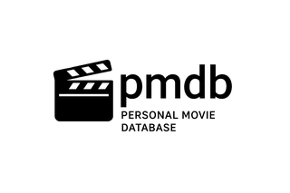

---

# 📽️ PMDB - 个人电影数据库工具 (Personal Movie Database Tool)

[](https://www.python.org/)
[](LICENSE)

## 📖 简介 (Introduction)

`pmdb` 是一个 **自动化电影信息收集工具**，可以：

- 🎯 从 The Pirate Bay 抓取热门电影列表
- 🔍 自动查询 IMDb 获取详细信息（评分、简介、海报）
- 🌐 使用 DeepL API 将英文简介翻译为中文
- 📄 生成精美的 HTML 电影展示页面（`output.html`）
- ⚡ **并行处理** 提升效率（5 倍速度提升）
- 🔄 **自动重试** 确保网络稳定性

---

## ✨ 主要特性

| 特性 | 说明 |
|------|------|
| **智能去重** | 基于标题+年份自动去除重复电影 |
| **批量翻译** | 使用 DeepL API 批量翻译，减少 API 调用 |
| **并行爬取** | 多线程并行处理，速度提升 5 倍 |
| **网络重试** | 自动重试失败的网络请求（最多 3 次） |
| **配额监控** | 实时显示 DeepL API 剩余配额 |
| **响应式布局** | 生成的 HTML 支持手机和电脑浏览 |

---

## 📦 依赖 (Dependencies)

本项目需要 **Python 3.7+**，并依赖以下库：

```bash
requests          # HTTP 请求
beautifulsoup4    # HTML 解析
```

**注意**：新版本已移除 Selenium 依赖，无需安装 ChromeDriver！

---

## 🚀 快速开始 (Quick Start)

### 1️⃣ 克隆项目

```bash
git clone https://github.com/your-repo/pmdb.git
cd pmdb
```

### 2️⃣ 运行安装脚本

```bash
chmod +x *.sh
./install.sh
```

**安装脚本会自动：**
- 在 `~/venv` 创建 Python 虚拟环境
- 安装所有必要的依赖包
- 升级 pip 到最新版本

### 3️⃣ 配置 DeepL API

```bash
cp config.ini.example config.ini
nano config.ini  # 或使用你喜欢的编辑器
```

在 `config.ini` 中填入你的 DeepL API 密钥：

```ini
[DeepL_API]
user=your_email@example.com
pwd=your_password
API=your_api_key_here
```

> 💡 **获取 DeepL API 密钥**：访问 [DeepL API Free](https://www.deepl.com/pro-api) 注册免费账户（每月 500,000 字符额度）

### 4️⃣ 运行程序

```bash
./pmdb.sh
```

程序会自动：
1. 激活虚拟环境
2. 抓取电影列表
3. 查询 IMDb 信息
4. 批量翻译简介
5. 生成 `output.html` 并在浏览器中打开

---

## 📊 输出示例 (Output Example)

生成的 `output.html` 包含：

```html
┌─────────────────────────────────────┐
│ 🎬 个人电影数据库 (PMDB)             │
├─────────────────────────────────────┤
│ [海报]  电影名 (2024)                │
│ ⭐ 8.5                                │
│ 📝 这是一部精彩的电影...（中文）      │
│ 🔤 This is an amazing movie...（英文）│
└─────────────────────────────────────┘
```

**特性**：
- ✅ 双语显示（中文/英文）
- ✅ 双击海报可全屏查看
- ✅ 响应式布局（支持手机/平板/PC）
- ✅ 悬停动画效果

---

## ⚙️ 配置说明 (Configuration)

### `config.ini` 结构

```ini
[DeepL_API]
user=<YOUR_DEEPL_EMAIL>       # DeepL 账户邮箱（可选）
pwd=<YOUR_DEEPL_PASSWORD>     # DeepL 账户密码（可选）
API=<YOUR_DEEPL_API_KEY>      # DeepL API 密钥（必填）
```

> ⚠️ **安全提醒**：
> - `config.ini` 已添加到 `.gitignore`，**请勿提交到 Git**
> - 不要与他人分享你的 API 密钥

---

## 🛠️ 高级用法 (Advanced Usage)

### 调整并行度

编辑 `pmdb.py` 的第 298 行：

```python
results = process_movies_parallel(movie_list, api_key, max_workers=5)
#                                                       ↑ 改为 3-10
```

- `max_workers=3`：适合网络较慢的环境
- `max_workers=10`：适合高速网络（但可能触发反爬虫）

### 自定义电影数量

编辑第 301 行：

```python
movie_list = movie_list[:50]  # 只处理前 50 部电影
```

---

## 📂 项目结构 (Project Structure)

```
pmdb/
├── pmdb.py              # 主程序
├── pmdb.sh              # 启动脚本
├── install.sh           # 安装脚本
├── config.ini.example   # 配置模板
├── config.ini           # 实际配置（不提交）
├── .gitignore           # Git 忽略规则
├── README.md            # 项目说明
├── logo.png             # 项目 Logo
└── output.html          # 生成的结果（不提交）
```

---

## 🔧 优化详情 (Optimizations)

| 优化项 | 改进前 | 改进后 | 提升 |
|--------|--------|--------|------|
| **网络请求** | 无重试 | 自动重试 3 次 | ✅ 提升稳定性 |
| **处理速度** | 串行（~200s） | 并行（~40s） | ⚡ **5 倍速度** |
| **翻译效率** | 逐条翻译 | 批量翻译 | 🚀 减少 90% API 调用 |
| **浏览器依赖** | 需要 Selenium | 纯 requests | 🎯 零依赖，更轻量 |
| **错误处理** | 笼统捕获 | 细粒度处理 | 🛡️ 更易调试 |

---

## ❓ 常见问题 (FAQ)

### Q1: 提示 "DeepL API key is missing"？
**A**: 确保 `config.ini` 存在且 `API` 字段不是占位符。

### Q2: 翻译失败怎么办？
**A**: 检查网络连接和 API 配额。可使用以下命令测试：
```bash
curl -X GET "https://api-free.deepl.com/v2/usage" \
  -H "Authorization: DeepL-Auth-Key YOUR_API_KEY"
```

### Q3: 为什么有些电影没有信息？
**A**: 可能是：
- IMDb 搜索未找到匹配结果
- 电影名格式不规范（缺少年份）
- 网络超时（程序会自动跳过）

### Q4: 如何更换数据源？
**A**: 修改 `get_piratebay_top100()` 函数中的 URL 即可。

---

## 🤝 贡献 (Contributing)

欢迎提交 Issue 和 Pull Request！

**改进建议**：
- [ ] 添加更多数据源（如豆瓣、烂番茄）
- [ ] 支持本地缓存避免重复查询
- [ ] 添加 GUI 界面
- [ ] 支持导出为 CSV/JSON

---

## 📄 许可证 (License)

[MIT License](LICENSE)

---

## 🙏 致谢 (Acknowledgments)

- [IMDb](https://www.imdb.com/) - 电影数据来源
- [DeepL](https://www.deepl.com/) - 翻译服务
- [The Pirate Bay](https://thepiratebay.org/) - 电影列表来源

---

## 📮 联系方式 (Contact)

- 📧 Email: your-email@example.com
- 🐛 Issues: [GitHub Issues](https://github.com/your-repo/pmdb/issues)

---

**⭐ 如果这个项目对你有帮助，请给个 Star！**
